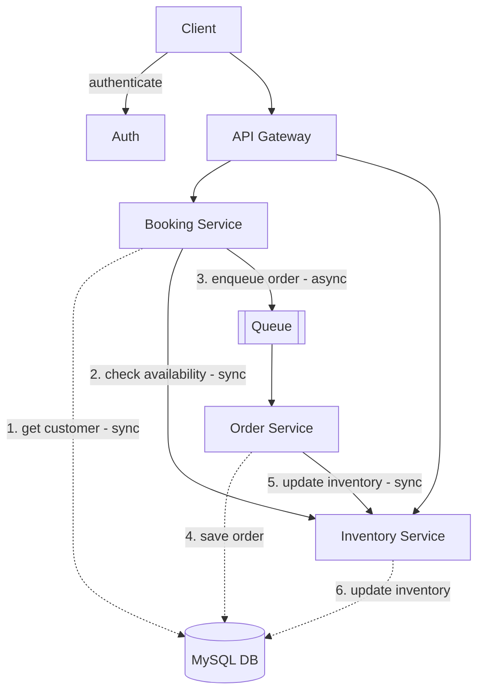

# Springboot Microservices — Ticket Buying System

Backend for a ticket-buying system built with Spring Boot, using a microservices architecture with a mix of synchronous and asynchronous communication between services.

## Architecture



**Flow:**
1. Client authenticates via **Auth**, then calls the **API Gateway**.
2. The gateway routes requests to the **Booking Service** or **Inventory Service**.
3. Booking Service fetches customer data from MySQL (sync) and checks stock/availability with the Inventory Service (sync).
4. Once a booking is validated, Booking Service pushes the order onto a **Queue** for async processing.
5. **Order Service** consumes the queue, persists the order to MySQL, and calls back to Inventory Service (sync) to update stock.
6. Inventory Service updates the final inventory count in MySQL.

## Services

| Service | Responsibility |
|---|---|
| API Gateway | Entry point; routes client requests to the appropriate service |
| Auth | Client authentication |
| Booking Service | Handles booking requests, validates customer + inventory, queues orders |
| Inventory Service | Tracks and updates ticket/seat availability |
| Order Service | Processes queued orders and persists them |

## Tech Stack

- Java 21
- Spring Boot 4.1.1
- MySQL (managed with MySQL Workbench)
- Message Queue: Kafka
- Docker Desktop (containerization)
- Postman (API testing/documentation)
- IntelliJ IDEA (development)
- Build tool: Maven

## Getting Started

### Prerequisites
- Java 21
- Maven
- Docker Desktop
- MySQL (via Docker container or local install, managed through MySQL Workbench)

### Setup

```bash
# clone the repo
git clone https://github.com/thesleepyhead/Springboot-microservices.git
cd Springboot-microservices

# configure database credentials
# edit application.properties in each service with your MySQL connection details

# build
./mvnw clean install
```

### Running with Docker

`<!-- If you have a docker-compose.yml, document it here, e.g.: -->`

```bash
docker-compose up --build
```

### Running the services

Each microservice runs independently. Start them in this order:

```bash
# 1. Auth service
cd auth-service && ./mvnw spring-boot:run

# 2. Inventory service
cd inventory-service && ./mvnw spring-boot:run

# 3. Booking service
cd booking-service && ./mvnw spring-boot:run

# 4. Order service
cd order-service && ./mvnw spring-boot:run

# 5. API Gateway
cd api-gateway && ./mvnw spring-boot:run
```

## API Documentation

API endpoints were tested and documented using Postman.

## Tests

```bash
./mvnw test
```
